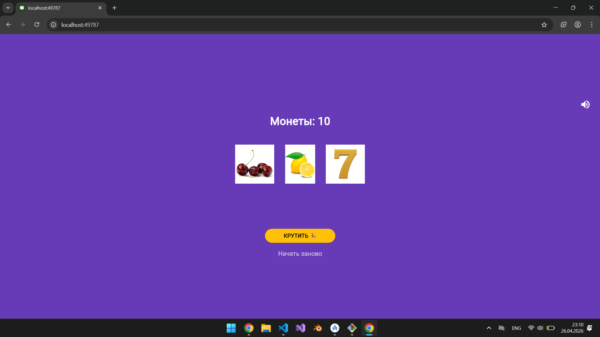
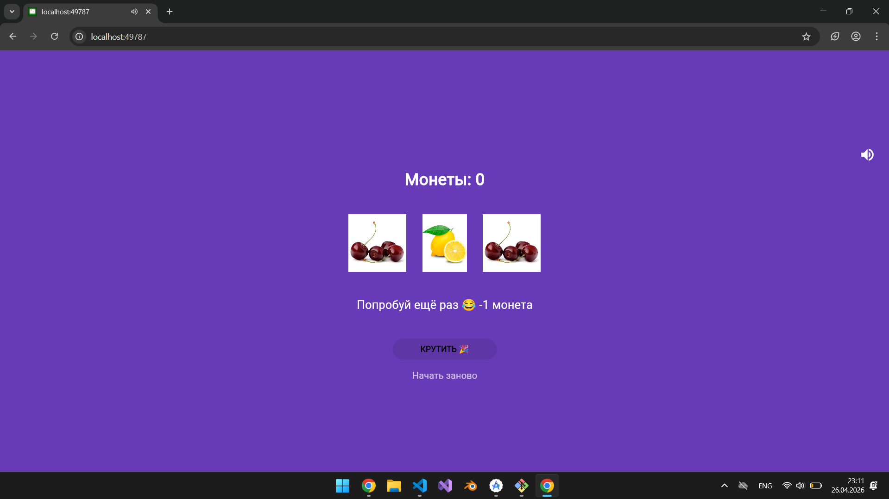

# 🎰 Слот-машина

Простое Flutter-приложение — симулятор игрового автомата. Крутите барабаны, собирайте одинаковые символы и выигрывайте монеты!

## Скриншоты

| Главный экран | Победа | Джекпот |
|---------------|--------|---------|
|  |   |

## Как играть

- Нажмите **КРУТИТЬ** чтобы запустить барабаны
- Три одинаковых символа — победа (+3 монеты)
- Три семёрки — джекпот (+10 монет)
- Разные символы — проигрыш (-1 монета)
- Начните заново кнопкой **Начать заново**
- Кнопка 🔇 отключает и включает звук

## Возможности

- 🎵 Фоновая музыка и звуковые эффекты
- 🎨 Анимированные барабаны
- 💰 Система монет
- 📱 Адаптивный дизайн

## Запуск проекта

**Требования:** Flutter 3.x, Dart 3.x

```bash

git clone https://github.com/Mikailov05/Android_Flutter_Lab6.git

cd slot_machine

flutter pub get


flutter run -d chrome
```

## Установка на Android

Скачайте готовый APK: [app-release.apk](build/app/outputs/flutter-apk/app-release.apk)

## Технологии

- **Flutter** 3.41.2
- **Dart** 3.11.0
- **audioplayers** — для кроссплатформенного звука
- **flutter_launcher_icons** — для генерации иконок
- Платформы: Web, Android

## Что изучено

- `StatefulWidget` и управление состоянием через `setState()`
- Работа с локальными изображениями через `Image.asset()`
- Генерация случайных чисел через `dart:math`
- Анимация через `async/await` и `AnimatedOpacity`
- Воспроизведение звука через `audioplayers`
- Создание иконки в Krita и подключение через `flutter_launcher_icons`
- Сборка под Web и Android

## Структура проекта

```
lib/
├── main.dart           # Точка входа, инициализация звука
├── slot_machine.dart   # Основной виджет игры
└── sound_service.dart  # Сервис управления звуком

assets/
├── images/             # Изображения символов
├── sounds/             # Звуковые файлы
└── icon/               # Иконка приложения
```

## Автор

Микаилов Ахмед — группа ИСП-231

Лабораторная работа №7, 2026
```